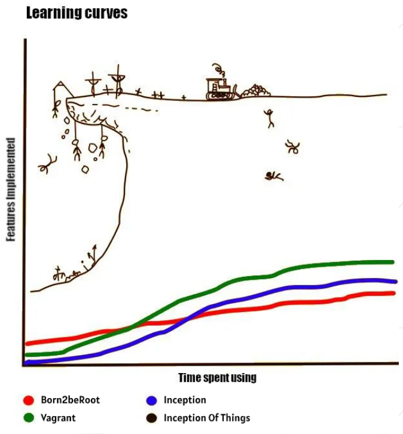

# Inception of Things
42 project - introduction to System Administration

## 📑 Introduction

In collaboration with [vkerob (vkerob)](https://github.com/vkerob), [jvasseur (juliovasseur)](https://github.com/juliovasseur) and [hubourge (hugo-bourgeon)](https://github.com/hugo-bourgeon).

**Inception of Things** is a project that explores container orchestration using **K3d**, **K3s**, **Vagrant**, and **Kubernetes**. The goal is to deploy lightweight **Kubernetes clusters** in a virtualized environment while automating machine management with **Vagrant**.

This project teaches how to **configure a cluster**, **orchestrate services**, and **automate deployments** while adopting a **DevOps** approach. 🚀



## 🔗 Table of contents

- [Part 1: K3s and Vagrant]()
- [Part 2: K3s and three simple applications]()
- [Part 3: K3d and Argo CD]()
- [Bonus: Gitlab integration]()

## 🌱 Installation

### Prerequisites
- Virtualbox app ([https://www.virtualbox.org/wiki/Downloads](https://www.virtualbox.org/wiki/Downloads))
- Ubuntu iso 24.04 LTS ([https://ubuntu.com/download/desktop](https://ubuntu.com/download/desktop))

**With the help of a [VirtualBox tutorial](https://wikilibriste.fr/tutoriels/virtualbox ), configure a VM using an Ubuntu ISO with the following specifications :**   
- 6 threads
- 8 GB of Ram
- 20 GB of storage

**Enable Nested Virtualization :**  
- Select VM -> Settings -> System -> Processor -> Enable Nested VT-x/AMD-V

**Enable SSH Communication in the VM :**  
- Select VM -> Settings -> Network -> Adapter 1 -> Attached to -> Bridged Adapter

```sh
sudo apt update && sudo apt install -y openssh-server
sudo systemctl start ssh
sudo ufw allow 22/tcp
sudo ufw allow 22
sudo ufw enable
ip a
```

The bridge is now initialized. To connect, use the username and local IP :
```sh
ssh vboxuser@ip
```

Install packages :
```sh
sudo apt install -y \
	git \
	vim \
	zsh \
	curl \
	wget
	
sh -c "$(curl -fsSL https://raw.githubusercontent.com/ohmyzsh/ohmyzsh/master/tools/install.sh)" "" --unattended

wget -O- https://apt.releases.hashicorp.com/gpg | sudo gpg --dearmor --batch --yes -o /usr/share/keyrings/hashicorp-archive-keyring.gpg
echo "deb [arch=$(dpkg --print-architecture) signed-by=/usr/share/keyrings/hashicorp-archive-keyring.gpg] https://apt.releases.hashicorp.com $(lsb_release -cs) main" | sudo tee /etc/apt/sources.list.d/hashicorp.list
sudo apt update -y && sudo apt install -y vagrant

sudo apt install -y virtualbox
sudo usermod -aG docker vboxuser
sudo usermod -aG sudo vboxuser

wget https://download.virtualbox.org/virtualbox/7.1.6/virtualbox-7.1_7.1.6-167084\~Ubuntu\~noble_amd64.deb
sudo dpkg -i virtualbox-7.1_7.1.6-167084\~Ubuntu\~noble_amd64.deb
```

## 🛰️ Clone project
```sh
git clone git@github.com:vkerob/Inception-of-Things.git
cd Inception-of-Things/
```


## 👨‍🎓 Contributors

- vincent, vkerob [https://github.com/vkerob](https://github.com/vkerob)  
- jules, jvasseur [https://github.com/juliovasseur](https://github.com/juliovasseur)  
- hugo, hubourge [https://github.com/hugo-bourgeon](https://github.com/hugo-bourgeon)