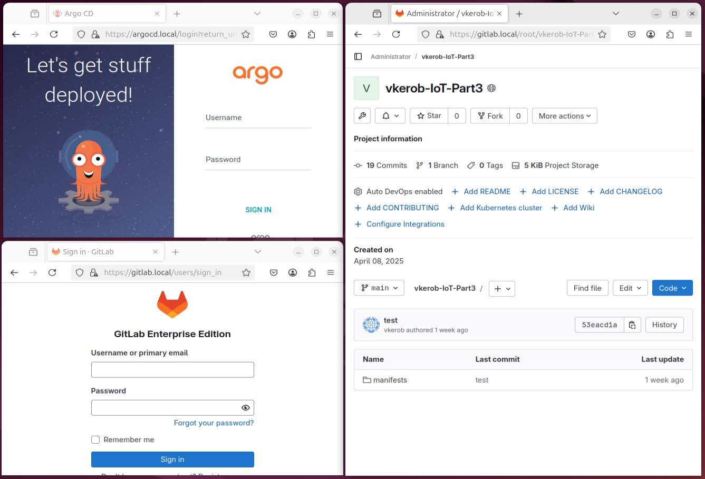
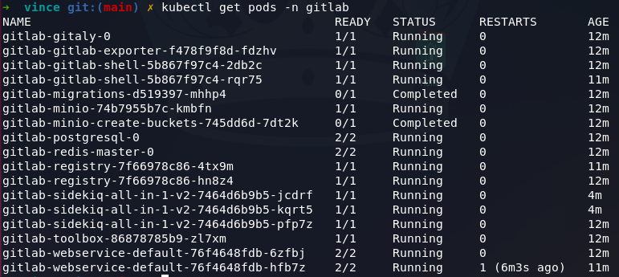
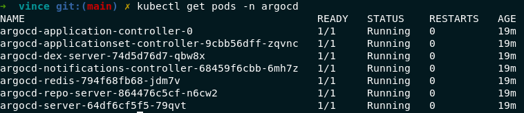

# Bonus: Gitlab integration

## 🎯 Objective

Host a **local GitLab instance**, configure it to work with **K3s/K3d**, and ensure **CI/CD automation** functions correctly within the cluster.  

## 📑 Overview  

- **Deploy GitLab locally** → Run a self-hosted GitLab instance.  
- **Create a `gitlab` namespace** → Isolate GitLab services in Kubernetes.  

> #### 💡 What is a namespace ?
> A **namespace** in Kubernetes **isolates resources within a cluster** to organize and separate resources from applications or environments (like dev, argocd).

- **Integrate GitLab with K3s/K3d** → Allow GitLab to interact with the cluster.  
- **CI/CD with GitLab** → Adapt ArgoCD & GitOps to work with the local GitLab. 

> **CI/CD** means continuous integration and continuous delivery/deployment.  

## 📂 Configuration Structure  

### `./confs/argocd` → Argo CD Deployment  
- **`argocd-app.yaml`** → Defines the application.  
	- ➡️ Pulls from GitHub.  
	- ➡️ Deploys to dev namespace.  
	- ➡️ Auto-syncs and removes outdated resources.  

- **`ingress.yaml`** → Configures Ingress.  
	- ➡️ Accessible at `argocd.local`.
	- ➡️ Uses **Traefik** to manage routing.
		> 💡 **Traefik** is a reverse proxy and load balancer for microservices.
	- ➡️ Secure access with `argocd-tls`.
	- ➡️ Forwards requests to `argocd-server` on port `80`.  

- **`namespace.yaml`** → Creates the `argocd` namespace.  
	- ➡️ [What is a namespace ?](#💡-what-is-a-namespace)  

### `./confs/dev` → Application Namespace  
- **`ingress.yaml`** → Configures Ingress. 
	- ➡️ Accessible at `dev.local`.
	- ➡️ Uses **Traefik** to manage routing.
		> 💡 **Traefik** is a reverse proxy and load balancer for microservices.
	- ➡️ Secure access with `argocd-tls`.
	- ➡️ Forwards requests to `argocd-server` on port `8080`.   

- **`namespace.yaml`** → Creates the `dev` namespace.  
	- ➡️ [What is a namespace ?](#💡-what-is-a-namespace)  

### `./confs/gitlab/` → **GitLab Setup**  
- **`gitlab-ingress.yaml`** → Configures Ingress.  
	- ➡️ Accessible at `gitlav.local`.
	- ➡️ Uses **Traefik** to manage routing.
		> 💡 **Traefik** is a reverse proxy and load balancer for microservices.
	- ➡️ Secure access with `argocd-tls`.
	- ➡️ Forwards requests to `argocd-server` on port `8181`.  

- **`gitlab-values.yaml`** → Helm values configuration for GitLab deployment.  
	- ➡️ Sets GitLab components, ports, and resource usage.  
	- ➡️ Customizes deployment (domain, user setup, etc.).  

- **`namespace.yaml`** → Creates the `gitlab` namespace.
	- ➡️ [What is a namespace ?](#💡-what-is-a-namespace)  

## 🗺️ Acces bonus part

Links :
> https://argocd.local/  
> https://gitlab.local/



This part involves integrating a **self-hosted GitLab instance** into our **K3d cluster** using a **local Docker image**. The goal is to push our **Kubernetes manifest** from **Part 3**, originally stored on **GitHub**, to this new GitLab repository.

ArgoCD will then be reconfigured to sync resources from the new **local GitLab repository**, replacing the dependency on the **GitHub repository**.

## 🧾 Global Summary: GitLab and argocd in Kubernetes

The command:
```sh
kubectl get pods -n gitlab
```



Displays **all GitLab pods** deployed in the **`gitlab` namespace**.

Each pod represents a **component** of the GitLab architecture running inside the Kubernetes cluster.

### ⚙️ Main Observed Components

| Pod Name | Description |
| --- | --- |
| `gitlab-webservice-default` | Main GitLab web server |
| `gitlab-sidekiq-all-in-1` | Background job processing |
| `gitlab-postgresql` | Primary database (PostgreSQL) |
| `gitlab-redis-master` | Caching and job queues (Redis) |
| `gitlab-registry` | Docker image registry |
| `gitlab-gitlab-shell` | Handles Git/SSH connections |
| `gitlab-gitaly` | Manages Git repository access |
| `gitlab-minio` | Object storage (S3 compatible) |
| `gitlab-toolbox` | Admin and maintenance tools |
| `gitlab-exporter` | Monitoring and metrics |
| `migrations`, `minio-create-buckets` | One-time init jobs (DB, storage) |

---

The command:
```sh
kubectl get pods -n agrocd
```



Displays **all argocd pods** deployed in the **`argocd` namespace**.

### ⚙️ Main Observed Components

| Pod Name | Description |
| --- | --- |
| `argocd-application-controller` | Manages application state and synchronizes resources |
| `argocd-applicationset-controller` | Manages multiple applications via ApplicationSets |
| `argocd-dex-server` | Handles authentication (OAuth, LDAP, etc.) |
| `argocd-notifications-controller` | Sends notifications (Slack, email, etc.) |
| `argocd-redis` | In-memory database used by Argo CD for caching |
| `argocd-repo-server` | Clones Git repos and renders Kubernetes manifests |
| `argocd-server` | Exposes the Web UI and API for Argo CD |

---

### 🏎️ About performances

We used **swap** method to improve performance management during execution.
**Swap** is a **disk space** used when **RAM** is full.

- 🛑 **Prevents crashes** when memory is exhausted.  
- 📦 Temporarily stores **inactive data** from RAM to disk.  
- 🐢 **Much slower** than RAM, since it uses the disk instead of memory.  

## ⌨️ Usefull command

```sh
# Configure and deploy :
# requirements, k3d, argocd, open_port, et show_id
make all 

# Delete cluster
make clean

# List existing clusters
kubectl config get-clusters

# List existing namespaces
kubectl get ns

# Check Dev pods
kubectl get pods -n dev

# Check GitLab pods  
kubectl get pods -n gitlab  
```

### 📖 [Home page](https://github.com/vkerob/Inception-of-Things#readme)
