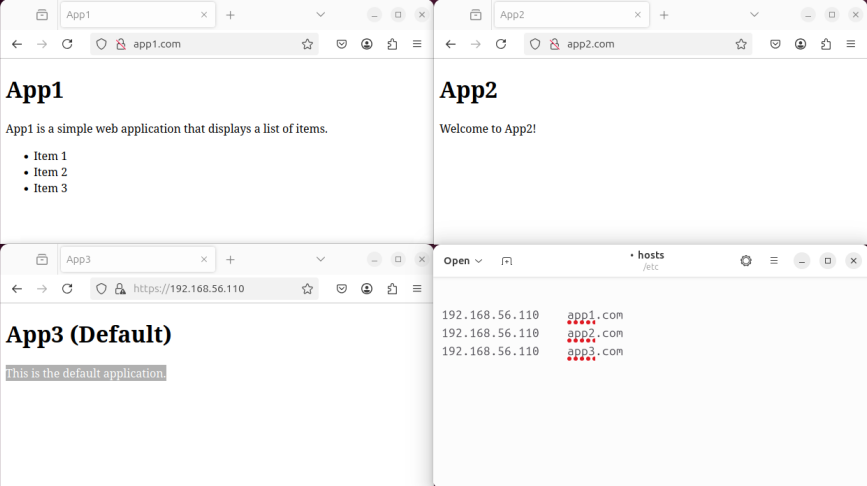

# Part 2: K3s and three simple applications

## 🎯 Objective

Three web applications are deployed on a **single virtual machine** running **K3s in server mode**. These applications are accessible based on the **HOST header** used when making requests to the machine's IP address (`192.168.56.110`).

## 📑 Overview

In this part, you'll deploy **3 web applications** on a single VM running **K3s in server mode**. The apps will be accessible based on the **HOST header**:

- **App1** → `app1.com`
- **App2** → `app2.com` (with **3 replicas**)
- **App3** → Default app for other requests

### Key Concepts:
- **Ingress** for routing
- **Replicas** management
- **K3s** orchestration

> Expected result after configuration  
> 

> **Replicas** in Kubernetes are copies of a pod. They ensure the **scaling** of applications by creating **multiple instances** of the same pod based on traffic needs. If a pod fails, Kubernetes automatically creates a new pod to maintain the specified number of replicas.

## 📦 Vagrantfile Setup

- 1️⃣ **Vagrantfile** setup with:
	- Linux OS distribution: `bento/debian-12`
	- **1 CPU** and **512 MB of RAM** minimum
	- Virtual machine with a specific name:
		- **jvasseurS** (IP: 192.168.56.110).

- 2️⃣ **`install_k3s_server.sh`** → Installs **K3s in server mode**.
- 3️⃣ **`install_app.sh`** → Deploys the **applications** on K3s.

## 📱 Application Deployment Process
This script deploys three web applications (app1, app2, app3) and configures them using **kubectl**. For each application, it:

- Creates a **ConfigMap** (stores configuration data) containing the `index.html` file.
- Applies the following Kubernetes files:
  - `service.yaml` → Defines the service.
  - `deployment.yaml` → Defines the application deployment.
  - `ingress.yaml` → Configures Ingress rules (for HTTP routing management).
  
- Configures Ingress to route HTTP traffic based on the **HOST** header.

> This allows hosting multiple applications on the same K3s server, with differentiated access via domain names (app1.com, app2.com, etc.).

## ⌨️ Usefull command

```sh
# Start the machines
vagrant up

# SSH connection to a machine
vagrant ssh jvasseurS
vagrant ssh jvasseurSW

# Show local IP informations
ip a show eth1

# Show all objects on cluster
kubectl get all

# Show nodes on cluster
kubectl get nodes -o wide

# Destroy the machines to reset everything
vagrant destroy -f
```


### 📖 [Home page](https://github.com/vkerob/Inception-of-Things#readme)