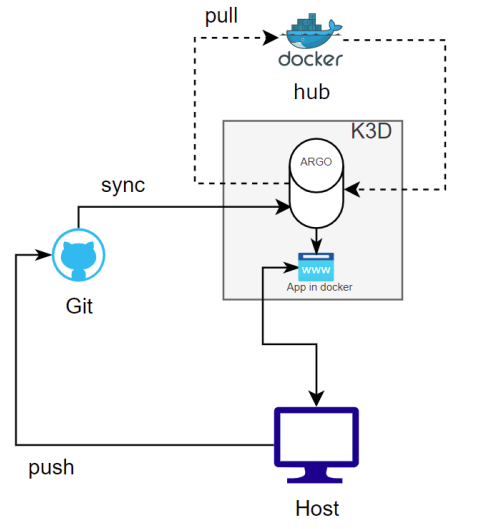
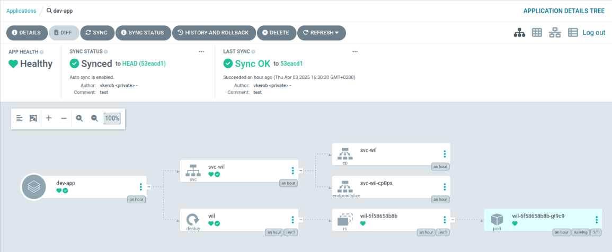
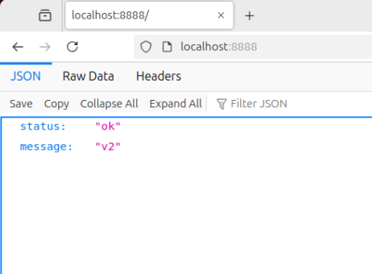

# Part 3: K3d and Argo CD

## 🎯 Objective
In this part of the project, the goal is to set up **K3d**, **Argo CD**, and implement **continuous integration** to automate the deployment of an application.

**Argo CD** is a GitOps tool that automates the deployment of applications in Kubernetes clusters.

## 📑 Overview

- 1️⃣ **K3d Setup**:  
   - Install **K3d**.

	> #### Difference Between K3s and K3d ?
	> - **K3s** is a lightweight Kubernetes distribution, optimized for resource-constrained environments.
	> - **K3d** provides an easier way to run **K3s** within Docker containers, allowing users to simulate Kubernetes clusters locally.

- 2️⃣ **Argo CD Setup**:  
   - Create two namespaces: **argocd** (for Argo CD) and **dev** (for your app).

	> #### What is a namespace ?
	> A **namespace** in Kubernetes **isolates resources within a cluster** to organize and separate resources from applications or environments (like dev, argocd).

- 3️⃣ **GitHub Repo**:  
   - Setup a public GitHub repository and push configuration files.
   - [https://github.com/vkerob/vkerob-IoT-Part3](https://github.com/vkerob/vkerob-IoT-Part3)

- 4️⃣ **Docker Image**:  
   - Use Wil’s pre-built app.
   - [https://hub.docker.com/r/wil42/playground](https://hub.docker.com/r/wil42/playground)

- 5️⃣ **Continuous Deployment**:  
   - **Argo CD** will automatically deploy the app from GitHub whenever changes are made.

	> #### What is Argo CD ?  
	> **Argo CD** is a **GitOps** tool that **automates** the deployment and synchronization of **Kubernetes applications** using a Git repository as the **single source of truth**. It ensures declarative and version-controlled deployments.  

---

### 🏗️ Illustrations

>   

> Diagram about global infrastructure    

>   

> Argocd application  

>   

> Dev app deploy at `http://localhost:8888`

## 📂 Configuration Structure  

### `./confs/argocd` → Argo CD Deployment  
- **`argocd-app.yaml`** → Defines the application.  
	- ➡️ Pulls from GitHub.  
	- ➡️ Deploys to dev namespace.  
	- ➡️ Auto-syncs and removes outdated resources.  
- **`ingress.yaml`** → Configures Ingress.  
	- ➡️ Accessible at `argocd.local`.
	- ➡️ Uses **Traefik** to manage routing.
		> **Traefik** is a reverse proxy and load balancer for microservices.
	- ➡️ Secure access with `argocd-tls`.
	- ➡️ Forwards requests to `argocd-server` on port `80`.  
- **`namespace.yaml`** → Creates the `argocd` namespace.  
	- ➡️ [What is a namespace ?](#what-is-a-namespace)  

### `./confs/dev` → Application Namespace  
- **`ingress.yaml`** → Configures Ingress. 
	- ➡️ Accessible at `dev.local`.
	- ➡️ Uses **Traefik** to manage routing.
		> **Traefik** is a reverse proxy and load balancer for microservices.
	- ➡️ Secure access with `argocd-tls`.
	- ➡️ Forwards requests to `argocd-server` on port `8080`.   
- **`namespace.yaml`** → Creates the `dev` namespace.  
	- ➡️ [What is a namespace ?](#what-is-a-namespace)  

## ⌨️ Usefull command

```sh
# Configure and deploy :
# requirements, k3d, argocd, open_port, et show_id
make all 

# Delete cluster
make clean

# List existing namespaces
kubectl get ns

# Check dev pods
kubectl get pods -n dev
```

### 📖 [Home page](https://github.com/vkerob/Inception-of-Things#readme)
